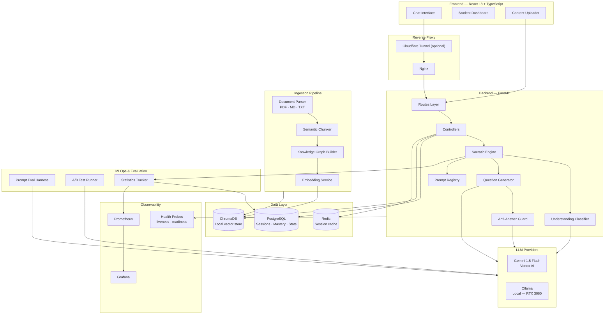
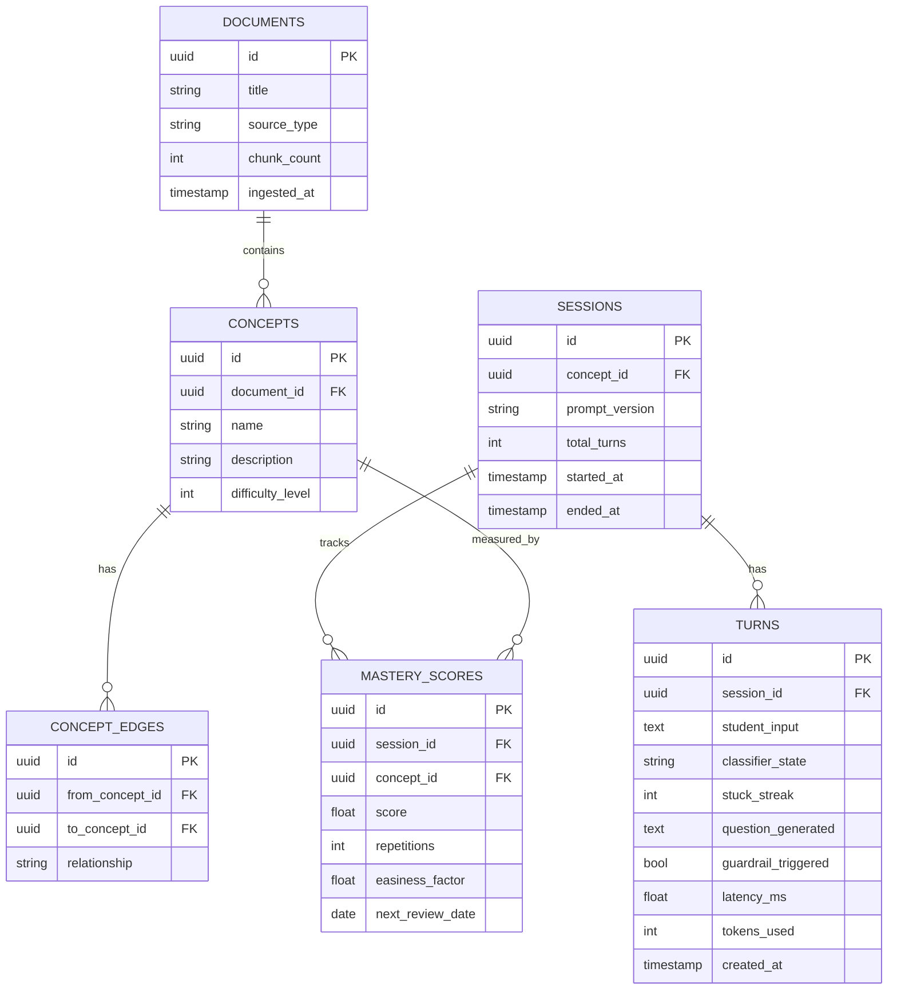

# Socratic Tutor — Production Specification

> A production-grade AI tutoring system that teaches through guided questioning rather than direct answers.
> Built for real deployment: containerised, observable, statistically grounded, and extensible.

---

## Core Concept

Every other AI tutoring tool answers questions. This one refuses to. The system classifies a student's understanding state on every turn and responds with a Socratic question calibrated to that state — never an explanation, never the answer. The hard engineering challenge is keeping the LLM inside that constraint consistently at production latency.

---

## Architecture Overview



---

## Project Structure

Follows the same layered pattern as Fehres: Routes → Controllers → Engine → Stores → Utils.

```
socratic-tutor/
├── SRC/                              # FastAPI backend
│   ├── main.py                       # App entry point, lifespan, middleware
│   ├── Routes/
│   │   ├── Session.py                # Start, continue, end session
│   │   ├── Content.py                # Upload, ingest, manage content
│   │   ├── Progress.py               # Mastery scores, session history
│   │   ├── Eval.py                   # Prompt evaluation endpoints
│   │   └── Health.py                 # /health/live and /health/ready
│   ├── Controllers/
│   │   ├── SessionController.py      # Orchestrates full dialogue turn
│   │   ├── IngestionController.py    # Parse → chunk → embed → store
│   │   └── ProgressController.py     # Mastery CRUD, spaced repetition scheduling
│   ├── Engine/                       # Socratic dialogue core
│   │   ├── SocraticEngine.py         # Main turn orchestrator
│   │   ├── UnderstandingClassifier.py
│   │   ├── QuestionGenerator.py
│   │   └── AntiAnswerGuard.py
│   ├── Models/
│   │   ├── Session.py                # SQLAlchemy: sessions, turns, mastery
│   │   ├── Content.py                # SQLAlchemy: documents, concepts, knowledge graph
│   │   └── Schemas.py                # Pydantic request/response schemas
│   ├── Stores/
│   │   ├── VectorStore.py            # ChromaDB abstraction
│   │   └── LLM/
│   │       ├── Providers/
│   │       │   ├── Gemini.py
│   │       │   └── Ollama.py
│   │       └── PromptRegistry.py     # Versioned prompt store, A/B routing
│   ├── Pipelines/
│   │   ├── IngestionPipeline.py      # PDF parse → semantic chunk → embed
│   │   ├── KnowledgeGraphBuilder.py  # LLM extracts concept dependencies
│   │   └── SpacedRepetition.py       # SM-2 algorithm
│   ├── Stats/
│   │   ├── MasteryTracker.py         # Per-concept confidence scoring
│   │   ├── SessionAnalytics.py       # Turn-level stats, stuck-streak tracking
│   │   └── Metrics.py                # Prometheus metrics definitions
│   ├── Utils/
│   │   ├── ContextManager.py         # Token budget enforcement, memory truncation
│   │   ├── StreamingHandler.py       # Async streaming wrapper for LLM calls
│   │   └── LanguageDetect.py
│   ├── Migrations/                   # Alembic migrations
│   │   └── versions/
│   ├── alembic.ini
│   ├── config.py                     # pydantic-settings + .env
│   └── requirements.txt
├── frontend/                         # React 18 + TypeScript SPA
│   ├── src/
│   │   ├── api/                      # Typed API clients (TanStack Query)
│   │   ├── components/
│   │   │   ├── chat/                 # ChatBubble, InputBar, TypingIndicator
│   │   │   ├── dashboard/            # MasteryRadar, SessionHistory, ConceptTree
│   │   │   └── upload/               # FileDropzone, IngestionProgress
│   │   ├── pages/
│   │   │   ├── TutorPage.tsx
│   │   │   ├── DashboardPage.tsx
│   │   │   └── ContentPage.tsx
│   │   ├── stores/                   # Zustand: session state, mastery cache
│   │   └── main.tsx
│   ├── package.json
│   └── vite.config.ts
├── Docker/
│   ├── docker-compose.yml
│   ├── docker-compose.dev.yml        # Infra only (DB, Redis, Chroma)
│   ├── nginx/nginx.conf
│   └── env/
│       ├── .env.app.example
│       ├── .env.postgres.example
│       └── .env.grafana.example
├── Eval/                             # Prompt evaluation harness
│   ├── datasets/                     # Annotated answer → expected_state pairs
│   ├── run_eval.py
│   └── report.py
├── monitoring/
│   ├── prometheus.yml
│   └── grafana/dashboards/
│       └── tutor_overview.json
├── dev.sh
├── dev-stop.sh
└── README.md
```

---

## Tech Stack

### Backend
| Component | Choice | Reason |
|---|---|---|
| Framework | FastAPI + uvicorn | Async-native, OpenAPI docs, matches Fehres pattern |
| Package manager | `uv` | Fast, lockfile-based |
| ORM + migrations | SQLAlchemy 2.0 + Alembic | Typed queries, versioned schema |
| Session DB | PostgreSQL 16 | Sessions, mastery scores, analytics |
| Vector DB | ChromaDB (local) | No infra overhead; swap to pgvector for cloud |
| Cache | Redis | Session state, classifier result cache |
| LLM — cloud | Gemini 1.5 Flash via Vertex AI | GCP-native, fast, cheap |
| LLM — local | Ollama (qwen3:8b / phi3:mini) | RTX 3060 12GB, fully offline fallback |
| Ingestion | LlamaIndex | PDF/MD/TXT parsing, semantic chunking |

### Frontend
| Component | Choice |
|---|---|
| Framework | React 18 + TypeScript |
| Build | Vite |
| State — server | TanStack Query |
| State — client | Zustand |
| UI primitives | React Aria Components |
| Styling | Tailwind CSS |
| Routing | React Router v6 |

### DevOps & Observability
| Component | Choice |
|---|---|
| Containers | Docker + Docker Compose |
| Reverse proxy | Nginx |
| Public exposure | Cloudflare Tunnel (optional) |
| Metrics | Prometheus |
| Dashboards | Grafana |
| CI | GitHub Actions |

---

## Database Schema



---

## The Dialogue Engine

### Turn Lifecycle

```
Student answer
    │
    ├──► [1] UnderstandingClassifier  (async, ~400ms, Redis-cached)
    │         → state: correct | partial | wrong | stuck
    │
    ├──► [2] QuestionGenerator        (streaming, tokens reach client at ~400ms)
    │         → mode: deepen | probe_gap | scaffold | micro_explain*
    │         → RAG context from ChromaDB (current concept chunks only)
    │         → conversation memory (last 3 turns, older summarised)
    │
    └──► [3] AntiAnswerGuard          (parallel with stream, ~500ms)
              → PASS: stream continues uninterrupted
              → FAIL: client receives SSE regenerating event, retry fires
              → max 2 retries before fallback scaffold question

* micro_explain activates only when stuck_streak >= 3 on same concept
```

### Understanding Classifier — Prompt Contract

```python
CLASSIFIER_SYSTEM = """
You are an educational assessment engine. Your only job is to classify
a student's response to a Socratic question.

Output a JSON object with exactly these fields:
{
  "state": "correct" | "partial" | "wrong" | "stuck",
  "confidence": float between 0 and 1,
  "gap": "one sentence describing what is missing or wrong, or null"
}

Rules:
- "correct": student demonstrates clear understanding of the target concept
- "partial": student shows some understanding but misses a key part
- "wrong": student's answer is factually incorrect
- "stuck": student says they don't know, asks for help, or gives a non-answer

Do not output anything other than the JSON object.
"""
```

### Socratic Question Generator — Prompt Contract

```python
SOCRATIC_SYSTEM = """
You are a Socratic tutor. You NEVER explain, NEVER give answers,
NEVER confirm whether the student is right or wrong.
You ask ONE question only. The question must:
- Be answerable from the provided source material
- Move the student exactly one step forward
- Match the student's current state:
    correct   → deepen: apply the concept somewhere harder
    partial   → probe the gap: target exactly what they missed
    wrong     → reframe: approach from a different angle
    stuck     → scaffold: ask a simpler prerequisite question

Current concept: {concept}
Student state: {state}
Gap identified: {gap}
Conversation so far (last 3 turns): {memory}
Relevant source material: {rag_context}

Output only the question. No preamble, no affirmation, no explanation.
"""
```

### Anti-Answer Guard — Prompt Contract

```python
GUARD_SYSTEM = """
You are a strict compliance checker for a Socratic tutoring system.
Inspect the following question and answer YES or NO only.

Does this question contain any of the following:
- A direct or indirect answer to the concept being studied
- An explanation of how something works
- A hint that strongly implies the answer
- Confirmation that the student was right or wrong

Question to inspect: {question}
Concept being studied: {concept}

Respond with exactly one word: YES or NO
"""
```

### Escape Hatch — Stuck Streak Override

```python
# In Engine/SocraticEngine.py
def resolve_mode(self, state: str, stuck_streak: int, concept_id: str) -> str:
    if state == "stuck" and stuck_streak >= 3:
        self.stats.log_escape_hatch(concept_id)
        return "micro_explain_then_ask"
    return state

# micro_explain: 2-3 sentence factual statement, then immediately returns
# to a Socratic question. Not surfaced as a mode change to the student.
```

---

## Latency Strategy

Target: < 1.5s perceived latency per turn.

```
Timeline (ms):
  0ms  ── Student submits answer
  0ms  ── Classifier fires (async) + session state write (async)
400ms  ── Classifier result ready
400ms  ── Question generator fires, first tokens stream to client
900ms  ── Guard check completes on buffered output
900ms  ── PASS: stream continues | FAIL: SSE regenerating event + retry
```

- Classifier results cached in Redis by `(concept_id, embedding_hash)` — 1h TTL
- Guard runs against a buffered copy; stream is not interrupted on pass
- `phi3:mini` handles classifier + guard (fast, low VRAM); `qwen3:8b` handles generation

---

## Context Window Management

Token budget per turn (targeting Gemini 1.5 Flash, cost-aware):

| Layer | Max tokens | Strategy |
|---|---|---|
| System prompt | ~400 | Fixed, never truncated |
| Concept definition | ~200 | Always included |
| RAG context | ~800 | Current concept chunks only |
| Conversation memory | ~600 | Last 3 raw turns; older → 1-line summary per concept block |
| Student answer | ~200 | Current turn only |
| **Total** | **~2,200** | Well within limits, cost-controlled |

```python
# In Utils/ContextManager.py
class ContextManager:
    MAX_RAW_TURNS = 3

    def build_memory(self, turns: list[Turn]) -> str:
        recent = turns[-self.MAX_RAW_TURNS:]
        older = turns[:-self.MAX_RAW_TURNS]
        summary = self._summarise_older(older) if older else ""
        raw = "\n".join(
            f"Student: {t.student_input}\nTutor: {t.question_generated}"
            for t in recent
        )
        return f"{summary}\n{raw}".strip()

    def _summarise_older(self, turns: list[Turn]) -> str:
        # Single LLM call: compress into one sentence per concept block
        ...
```

---

## Statistics & MLOps

### Mastery Scoring — SM-2 Algorithm

```python
# In Pipelines/SpacedRepetition.py
class SM2:
    """
    quality mapping from classifier state:
        correct → 5  |  partial → 3  |  wrong → 1  |  stuck → 0
    """
    def update(self, score: MasteryScore, quality: int) -> MasteryScore:
        if quality < 3:
            score.repetitions = 0
            score.interval = 1
        else:
            score.easiness_factor = max(
                1.3,
                score.easiness_factor + 0.1 - (5 - quality) * 0.08
            )
            score.interval = (
                1 if score.repetitions == 0
                else 6 if score.repetitions == 1
                else round(score.interval * score.easiness_factor)
            )
            score.repetitions += 1
        score.next_review_date = date.today() + timedelta(days=score.interval)
        return score
```

### Prometheus Metrics

```python
# In Stats/Metrics.py
TURN_LATENCY = Histogram(
    "tutor_turn_latency_seconds",
    "End-to-end latency per dialogue turn",
    buckets=[0.5, 1.0, 1.5, 2.0, 3.0, 5.0]
)
CLASSIFIER_STATE = Counter(
    "tutor_classifier_state_total",
    "Count of each understanding state",
    ["state"]   # correct, partial, wrong, stuck
)
GUARDRAIL_TRIGGERS = Counter(
    "tutor_guardrail_triggers_total",
    "Times the anti-answer guard rejected a question"
)
ESCAPE_HATCH_ACTIVATIONS = Counter(
    "tutor_escape_hatch_total",
    "Stuck-streak override activations",
    ["concept_id"]
)
TOKENS_PER_TURN = Histogram(
    "tutor_tokens_per_turn",
    "Total tokens across all LLM calls per turn"
)
MASTERY_SCORE = Gauge(
    "tutor_mastery_score",
    "Current mastery score per concept",
    ["concept_id"]
)
```

### Prompt Evaluation Harness

```python
# In Eval/run_eval.py
# Dataset: list of {student_answer, concept, expected_state, expected_gap_theme}
# Run on every push via GitHub Actions

class ClassifierEval:
    def run(self, dataset_path: str, prompt_version: str) -> EvalReport:
        dataset = load_jsonl(dataset_path)
        results = []
        for sample in dataset:
            predicted = self.classifier.classify(
                answer=sample["student_answer"],
                concept=sample["concept"],
                prompt_version=prompt_version
            )
            results.append({
                "expected": sample["expected_state"],
                "predicted": predicted.state,
                "confidence": predicted.confidence
            })
        return EvalReport(
            accuracy=accuracy_score(...),
            f1_per_state=f1_score(..., average=None),
            prompt_version=prompt_version
        )
```

### Prompt Registry — Versioned Prompts with A/B Routing

```python
# In Stores/LLM/PromptRegistry.py
class PromptRegistry:
    """
    Versioned prompts stored in PostgreSQL.
    A/B routing via deterministic session_id hashing.
    Every TURN row records prompt_version — enables offline
    analysis of which version produces better mastery outcomes.
    """
    def get_prompt(self, name: str, session_id: str) -> tuple[str, str]:
        active_versions = self.db.get_active_versions(name)
        version = self._route(active_versions, session_id)
        return version.template, version.version_id

    def _route(self, versions: list, session_id: str) -> PromptVersion:
        bucket = int(hashlib.md5(session_id.encode()).hexdigest(), 16) % 100
        cumulative = 0
        for v in versions:
            cumulative += v.traffic_pct
            if bucket < cumulative:
                return v
        return versions[-1]
```

---

## Docker Compose — Full Production Stack

```yaml
# Docker/docker-compose.yml
services:
  postgres:
    image: postgres:16
    env_file: ./env/.env.postgres
    volumes:
      - postgres_data:/var/lib/postgresql/data
    healthcheck:
      test: ["CMD-SHELL", "pg_isready -U $POSTGRES_USER"]
      interval: 10s
      timeout: 5s
      retries: 5

  redis:
    image: redis:7-alpine
    volumes:
      - redis_data:/data
    healthcheck:
      test: ["CMD", "redis-cli", "ping"]

  chromadb:
    image: chromadb/chroma:latest
    volumes:
      - chroma_data:/chroma/chroma
    ports:
      - "8001:8000"

  fastapi:
    build:
      context: ../SRC
      dockerfile: Dockerfile
    env_file: ./env/.env.app
    depends_on:
      postgres:
        condition: service_healthy
      redis:
        condition: service_healthy
    ports:
      - "8000:8000"

  frontend:
    build:
      context: ../frontend
      dockerfile: Dockerfile
    ports:
      - "5173:80"

  nginx:
    image: nginx:alpine
    volumes:
      - ./nginx/nginx.conf:/etc/nginx/nginx.conf:ro
    ports:
      - "8888:80"
    depends_on:
      - fastapi
      - frontend

  prometheus:
    image: prom/prometheus
    volumes:
      - ../monitoring/prometheus.yml:/etc/prometheus/prometheus.yml
    ports:
      - "9090:9090"

  grafana:
    image: grafana/grafana
    env_file: ./env/.env.grafana
    volumes:
      - grafana_data:/var/lib/grafana
      - ../monitoring/grafana/dashboards:/etc/grafana/provisioning/dashboards
    ports:
      - "3000:3000"
    depends_on:
      - prometheus

volumes:
  postgres_data:
  redis_data:
  chroma_data:
  grafana_data:
```

---

## Health Probes

```python
# In Routes/Health.py
@router.get("/health/live")
async def liveness():
    return {"status": "ok"}

@router.get("/health/ready")
async def readiness(db=Depends(get_db), redis=Depends(get_redis)):
    checks = {}
    try:
        db.execute(text("SELECT 1"))
        checks["postgres"] = "ok"
    except Exception as e:
        checks["postgres"] = str(e)
    try:
        redis.ping()
        checks["redis"] = "ok"
    except Exception as e:
        checks["redis"] = str(e)
    try:
        chroma_client.heartbeat()
        checks["chromadb"] = "ok"
    except Exception as e:
        checks["chromadb"] = str(e)

    all_ok = all(v == "ok" for v in checks.values())
    return JSONResponse(
        status_code=200 if all_ok else 503,
        content={"status": "ready" if all_ok else "degraded", "checks": checks}
    )
```

---

## CI/CD — GitHub Actions

```yaml
# .github/workflows/ci.yml
name: CI
on: [push, pull_request]

jobs:
  backend:
    runs-on: ubuntu-latest
    steps:
      - uses: actions/checkout@v4
      - uses: astral-sh/setup-uv@v3
      - run: uv sync
        working-directory: SRC
      - run: uv run pytest tests/ -v --cov=. --cov-report=xml
        working-directory: SRC
      - name: Run prompt eval harness
        run: uv run python -m Eval.run_eval --dataset Eval/datasets/classifier_v1.jsonl

  frontend:
    runs-on: ubuntu-latest
    steps:
      - uses: actions/checkout@v4
      - uses: pnpm/action-setup@v4
      - run: pnpm install && pnpm run build && pnpm run lint
        working-directory: frontend

  docker:
    runs-on: ubuntu-latest
    needs: [backend, frontend]
    steps:
      - uses: actions/checkout@v4
      - run: docker compose -f Docker/docker-compose.yml build
```

---

## Local LLM — Recommended Models (RTX 3060 12GB)

| Role | Model | VRAM |
|---|---|---|
| Generation | `qwen3:8b` | ~6GB |
| Embeddings | `nomic-embed-text` | ~0.5GB |
| Classifier + Guard | `phi3:mini` | ~2.5GB |

```bash
ollama pull qwen3:8b
ollama pull nomic-embed-text
ollama pull phi3:mini
```

Total VRAM ~9GB — fits the 3060. Classifier and guard run on `phi3:mini` (fast, cheap). Generation runs on `qwen3:8b` (better reasoning).

---

## Environment Variables

```env
# SRC/.env.example

# LLM
GENERATION_BACKEND=GEMINI          # GEMINI | OLLAMA
EMBEDDING_BACKEND=GEMINI
CLASSIFIER_MODEL_ID=phi3:mini      # Fast model for classifier + guard
GENERATION_MODEL_ID=gemini-1.5-flash
EMBEDDING_MODEL_ID=text-embedding-004
OLLAMA_BASE_URL=http://localhost:11434

# GCP
GOOGLE_CLOUD_PROJECT=your-project-id
GOOGLE_APPLICATION_CREDENTIALS=/path/to/sa.json

# Database
POSTGRES_HOST=localhost
POSTGRES_PORT=5432
POSTGRES_DB=socratic_tutor
POSTGRES_USER=tutor
POSTGRES_PASSWORD=changeme

# Redis
REDIS_URL=redis://localhost:6379

# ChromaDB
CHROMA_HOST=localhost
CHROMA_PORT=8001

# Engine
MAX_STUCK_STREAK=3
MAX_GUARDRAIL_RETRIES=2
CONTEXT_MAX_RAW_TURNS=3
CONTEXT_MAX_TOKENS=2200
LLM_REQUEST_TIMEOUT=30

# Prompt versioning
DEFAULT_PROMPT_VERSION=v1.0.0
ENABLE_AB_TESTING=false
```

---

## API Endpoints

| Method | Path | Description |
|---|---|---|
| `POST` | `/api/v1/content/upload` | Upload PDF/MD/TXT |
| `POST` | `/api/v1/content/ingest/{doc_id}` | Run ingestion pipeline |
| `GET` | `/api/v1/content/concepts/{doc_id}` | Return extracted knowledge graph |
| `POST` | `/api/v1/session/start` | Start session for a concept |
| `POST` | `/api/v1/session/{id}/turn` | Submit answer, receive next question (SSE stream) |
| `POST` | `/api/v1/session/{id}/end` | End session, trigger summary generation |
| `GET` | `/api/v1/progress/mastery/{user_id}` | All mastery scores |
| `GET` | `/api/v1/progress/due` | Concepts due for spaced repetition review |
| `GET` | `/api/v1/progress/session/{id}/summary` | End-of-session gap report |
| `POST` | `/api/v1/eval/classifier` | Run prompt eval harness against a dataset |
| `GET` | `/api/v1/health/live` | Liveness probe |
| `GET` | `/api/v1/health/ready` | Readiness probe |
| `GET` | `/metrics` | Prometheus scrape endpoint |

---

## Grafana Dashboard — Key Panels

| Panel | Metric | Purpose |
|---|---|---|
| Turn latency p50/p95 | `tutor_turn_latency_seconds` | Catch latency regressions |
| Classifier state distribution | `tutor_classifier_state_total` | Detect persistent stuck patterns |
| Guardrail trigger rate | `tutor_guardrail_triggers_total` | Flag prompt regressions |
| Escape hatch activations | `tutor_escape_hatch_total` | Concepts needing better scaffolding |
| Tokens per turn | `tutor_tokens_per_turn` | Cost monitoring |
| Mastery score over time | `tutor_mastery_score` by concept | Learning outcome tracking |

---

## Pitfalls & Mitigations

### Latency Trap
Two to three LLM calls per turn. Mitigated by: streaming output (perceived latency < actual), async classifier, Redis caching for repeated answers, routing fast turns to skip the guard when classifier confidence > 0.95.

### Frustration Loop
Pure Socratic dialogue without relief causes abandonment. Mitigated by: the stuck-streak escape hatch (transparent to the student), SM-2 scheduling that reduces revisit frequency for mastered concepts, and session summaries that reframe struggle as progress.

### Context Window Bloat
System prompt + RAG + memory + answer inflates quickly. Mitigated by: strict 2,200-token budget, aggressive memory summarisation after turn 3, and concept-scoped RAG retrieval only.

### Prompt Drift
Prompt changes silently break classifier accuracy. Mitigated by: versioned prompt registry in PostgreSQL, automated eval harness in CI on every push, and A/B routing that preserves rollback capability.

---

## Week-by-Week Build Plan

> 5–8 hours per week. No Streamlit. No shortcuts.

| Week | Milestone | Done when |
|---|---|---|
| 1 | Repo scaffold + Docker infra | `docker compose up` starts Postgres, Redis, Chroma, Prometheus, Grafana |
| 2 | Alembic schema + ingestion pipeline | PDF → concept graph → ChromaDB confirmed via API |
| 3 | Understanding Classifier + eval harness | 85%+ accuracy on 50 labelled samples |
| 4 | Question Generator + Anti-Answer Guard + streaming | Full turn in terminal, guard catches leaks |
| 5 | SocraticEngine orchestrator + session lifecycle | `/session/start`, `/turn`, `/end` all working |
| 6 | Mastery tracker + SM-2 + spaced repetition API | `/progress/due` returns correctly scheduled concepts |
| 7 | React frontend — chat + dashboard | Streaming renders in browser, mastery radar chart works |
| 8 | Prometheus metrics + Grafana dashboard | All 6 key panels populated from real session data |
| 9 | CI pipeline + prompt eval in GitHub Actions | CI passes on every push, eval report generated |
| 10 | Polish, demo video, LinkedIn post | End-to-end demo on one real subject (e.g. intro Python) |

---

## LinkedIn Post Angle

> "I tried to build an AI tutor. The hard part wasn't the AI — it was teaching the AI to shut up."

Follow up with: the understanding classifier as a structured output problem, the guardrail as a second LLM safety layer, and the Prometheus dashboard showing guardrail trigger rate dropping across prompt versions. That's the story of an engineer who thinks in systems, not just prompts.
