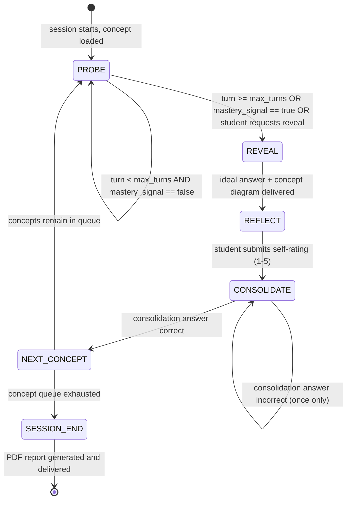
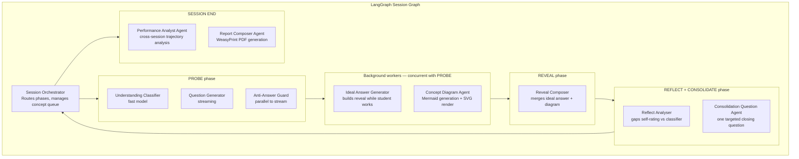

# Socratic Tutor — Stage 2: Multi-Agent Teaching System

> Stage 1 proved the Socratic dialogue engine works. Stage 2 turns it into a complete
> teaching product: phased sessions, background answer generation, concept visualisation,
> and rich PDF performance reports — orchestrated by a LangGraph multi-agent graph.

---

## What Changed and Why

Stage 1's problem: endless questioning with no resolution is pedagogically valid but
commercially weak. Users disengage when they never get confirmation, never see the full
picture, and never receive a record of what they learned.

Stage 2 reframes the product: **the Socratic phase is the opening act, not the whole show.**
After a bounded questioning window, the system reveals the ideal answer, explains the concept
visually, invites reflection, and ends with a generated PDF report the student can keep.
That is a session arc users will return to.

The second shift is architectural: Stage 1 had one engine with three prompts. Stage 2 has
a **LangGraph agent graph** where each agent owns a distinct responsibility, runs
concurrently where possible, and can be swapped between API and local LLMs with a single
config change.

---

## Framework Decision: LangGraph

LangGraph is a state-machine graph over LangChain-compatible agents. It was chosen over
CrewAI and AutoGen for three reasons specific to this project:

**Explicit state management.** The session state (current phase, turn count, mastery signal,
concept queue) is a first-class typed object passed through the graph. Every edge condition
and phase transition is visible code, not implicit agent conversation.

**LLM-agnostic by design.** Any LangChain-compatible LLM works: `ChatVertexAI` for Gemini,
`ChatOllama` for local models, `ChatOpenAI` as a fallback. Switching providers is one env
var. Routing fast tasks (classifier, guard) to a small local model and generation to a
cloud model is a two-line config.

**Native checkpointing.** LangGraph's `PostgresSaver` persists full graph state to PostgreSQL
after every node. Sessions survive restarts, can be resumed, and the full turn history is
queryable without extra bookkeeping.

```python
# In Engine/graph.py — provider config
from langchain_google_vertexai import ChatVertexAI
from langchain_ollama import ChatOllama

def get_llm(role: str) -> BaseChatModel:
    backend = settings.GENERATION_BACKEND
    if backend == "GEMINI":
        return ChatVertexAI(model_name=settings.GENERATION_MODEL_ID, streaming=True)
    elif backend == "OLLAMA":
        model = (
            settings.CLASSIFIER_MODEL_ID if role == "classifier"
            else settings.GENERATION_MODEL_ID
        )
        return ChatOllama(model=model, base_url=settings.OLLAMA_BASE_URL)
    raise ValueError(f"Unknown backend: {backend}")
```

---

## Session Phase Architecture

The session is no longer a loop. It is a directed graph of four phases per concept,
with explicit entry and exit conditions at every edge.



### Phase Definitions

**PROBE** — the Socratic phase from Stage 1, now bounded. Default max turns: 5, configurable
per concept difficulty. Exit conditions: turn limit reached, classifier returns `correct` with
confidence > 0.85, or student types `/reveal`.

**REVEAL** — the system delivers two things simultaneously via SSE: the ideal answer (streamed
text) and a concept diagram (Mermaid rendered server-side to SVG). Both were generated in the
background during PROBE — the student sees them instantly at phase transition.

**REFLECT** — student rates their own understanding (1–5) after the reveal. This rating feeds
into the SM-2 mastery score alongside the classifier's objective assessment. The gap between
self-rating and classifier confidence is itself a learning signal (Dunning-Kruger detection).

**CONSOLIDATE** — one final question, generated with knowledge that the student has now seen
the full explanation. Its purpose is to confirm the explanation landed, not to probe blindly.
It does not loop beyond one retry.

---

## Multi-Agent Graph



### Graph State Schema

```python
# In Engine/state.py
from typing import Annotated
from langgraph.graph.message import add_messages
from pydantic import BaseModel

class ConceptState(BaseModel):
    concept_id: str
    name: str
    difficulty: int                      # 1–5
    max_probe_turns: int                 # derived from difficulty
    probe_turns: int = 0
    classifier_states: list[str] = []
    stuck_streak: int = 0
    mastery_signal: bool = False
    ideal_answer: str | None = None      # set by background worker during PROBE
    concept_diagram_svg: str | None = None

class SessionState(TypedDict):
    session_id: str
    user_id: str
    phase: str                           # PROBE | REVEAL | REFLECT | CONSOLIDATE | END
    concept_queue: list[ConceptState]
    current_concept: ConceptState | None
    messages: Annotated[list, add_messages]
    self_rating: int | None
    session_stats: dict                  # running tallies for report
    report_pdf_path: str | None
    prompt_version: str
```

### Node Implementations

```python
# In Engine/nodes.py

async def probe_node(state: SessionState, config: RunnableConfig) -> dict:
    """Runs one PROBE turn: classify → generate question → guard."""
    concept = state["current_concept"]
    llm_fast = get_llm("classifier")
    llm_gen = get_llm("generator")

    # Classifier — Redis-cached if answer is near-duplicate
    classifier_result = await classify_answer(
        answer=state["messages"][-1].content,
        concept=concept,
        llm=llm_fast,
        cache=redis_client
    )

    # Mastery exit condition
    if classifier_result.state == "correct" and classifier_result.confidence > 0.85:
        return {"current_concept": concept.model_copy(update={"mastery_signal": True})}

    # Question generation (streaming) + Guard (parallel)
    question = await generate_socratic_question(
        classifier_result=classifier_result,
        concept=concept,
        memory=build_memory(state["messages"]),
        llm=llm_gen
    )
    passed = await anti_answer_guard(question, concept, llm=llm_fast)
    if not passed:
        question = await fallback_scaffold_question(concept, llm=llm_gen)

    return {
        "messages": [AIMessage(content=question)],
        "current_concept": concept.model_copy(update={
            "probe_turns": concept.probe_turns + 1,
            "classifier_states": [*concept.classifier_states, classifier_result.state],
            "stuck_streak": (
                concept.stuck_streak + 1 if classifier_result.state == "stuck" else 0
            )
        })
    }


async def background_worker_node(state: SessionState, config: RunnableConfig) -> dict:
    """
    Fires concurrently at PROBE phase start via LangGraph Send API.
    Prepares REVEAL content so it is ready the moment the phase transitions.
    Average PROBE is 60-120s. Background worker completes in 3-15s.
    Student waits zero seconds for the reveal.
    """
    concept = state["current_concept"]
    llm = get_llm("generator")

    ideal_answer, diagram_mermaid = await asyncio.gather(
        generate_ideal_answer(concept, llm),
        generate_concept_diagram(concept, llm)
    )
    diagram_svg = await render_mermaid_to_svg(diagram_mermaid)

    return {
        "current_concept": concept.model_copy(update={
            "ideal_answer": ideal_answer,
            "concept_diagram_svg": diagram_svg
        })
    }


async def reveal_node(state: SessionState) -> dict:
    """Composes and streams the reveal payload to the client."""
    concept = state["current_concept"]
    reveal_payload = {
        "type": "reveal",
        "ideal_answer": concept.ideal_answer,
        "concept_diagram_svg": concept.concept_diagram_svg,
        "probe_summary": summarise_probe_performance(concept)
    }
    return {"messages": [AIMessage(content=json.dumps(reveal_payload))]}


async def report_node(state: SessionState) -> dict:
    """Runs at session end. Calls PerformanceAnalyst then ReportComposer."""
    llm = get_llm("generator")
    analyst_output = await analyse_session_performance(state, llm)
    pdf_path = await compose_pdf_report(state, analyst_output)
    return {"report_pdf_path": pdf_path}
```

### Edge Conditions (Phase Routing)

```python
# In Engine/edges.py

def route_probe(state: SessionState) -> str:
    concept = state["current_concept"]
    if concept.mastery_signal:
        return "reveal"
    if concept.probe_turns >= concept.max_probe_turns:
        return "reveal"
    if state["messages"][-1].content.strip() == "/reveal":
        return "reveal"
    return "probe"

def route_after_consolidate(state: SessionState) -> str:
    last_state = state["current_concept"].classifier_states[-1]
    remaining = state["concept_queue"]
    if last_state in ("correct", "partial") and remaining:
        return "next_concept"
    if not remaining:
        return "report"
    return "consolidate"    # one retry

# Graph assembly
builder = StateGraph(SessionState)
builder.add_node("probe", probe_node)
builder.add_node("background_worker", background_worker_node)
builder.add_node("reveal", reveal_node)
builder.add_node("reflect", reflect_node)
builder.add_node("consolidate", consolidate_node)
builder.add_node("report", report_node)

builder.add_conditional_edges("probe", route_probe)
builder.add_edge("reveal", "reflect")
builder.add_edge("reflect", "consolidate")
builder.add_conditional_edges("consolidate", route_after_consolidate)
builder.add_edge("report", END)

# Checkpointer: full graph state persisted to Postgres after every node
checkpointer = PostgresSaver.from_conn_string(settings.POSTGRES_URL)
graph = builder.compile(checkpointer=checkpointer)
```

### Parallel Branch Dispatch

```python
# In Engine/graph.py — background worker fired concurrently via Send API

def probe_entry(state: SessionState) -> list[Send]:
    """Called at the start of every concept's PROBE phase."""
    return [
        Send("probe", state),
        Send("background_worker", state)    # runs concurrently, no blocking
    ]

builder.add_conditional_edges(
    "concept_start",
    probe_entry,
    ["probe", "background_worker"]
)
```

---

## Ideal Answer Generator Agent

```python
IDEAL_ANSWER_SYSTEM = """
You are an expert teacher writing a model answer for a student who has just
attempted to answer questions about the following concept.

Your answer must:
- Be complete and correct, grounded only in the provided source material
- Be appropriate for difficulty tier {difficulty}/5
- Be structured: one clear statement of the core idea, then supporting explanation
- Be concise: 100-200 words maximum
- NOT reference the student's attempt or the Socratic dialogue

Concept: {concept}
Source material: {rag_context}

Write the model answer only. No preamble.
"""
```

---

## Concept Diagram Agent

Generates Mermaid code, rendered server-side to SVG using Playwright headless
Chromium — the same Playwright dependency already used by Fehres for scraping.

```python
DIAGRAM_SYSTEM = """
You are an educational diagram designer. Generate a Mermaid diagram that visually
explains the following concept to a student.

Rules:
- Use flowchart TD or graph LR — whichever fits the concept structure better
- Maximum 10 nodes. Every node label must be under 6 words.
- Show the mechanism, not a list: cause → effect, components → relationships, steps → order
- No title node. No legend nodes.
- Output only the raw Mermaid code. Nothing else.

Concept: {concept}
Description: {description}
"""

async def render_mermaid_to_svg(mermaid_code: str) -> str:
    """
    Server-side rendering via Playwright. Returns SVG string for embedding
    in the chat SSE payload and in the PDF report.
    """
    async with async_playwright() as p:
        browser = await p.chromium.launch()
        page = await browser.new_page()
        await page.set_content(MERMAID_HTML_TEMPLATE.format(code=mermaid_code))
        await page.wait_for_selector("svg")
        svg = await page.inner_html("svg")
        await browser.close()
    return svg
```

---

## Performance Analyst Agent

```python
ANALYST_SYSTEM = """
You are an educational performance analyst. Analyse this session and produce
a structured JSON assessment.

Session data:
- Concepts covered: {concepts}
- Per-concept probe turns: {probe_turns_per_concept}
- Classifier state sequences: {classifier_sequences}
- Self-ratings vs classifier confidence: {rating_gap}
- Escape hatch activations: {escape_hatch_count}
- Mastery scores before and after: {mastery_delta}

Output a JSON object with exactly these fields:
{
  "overall_performance": "struggling" | "developing" | "solid" | "strong",
  "strongest_concept": string,
  "weakest_concept": string,
  "insight": "2-3 sentence personalised observation about this student's learning pattern",
  "recommendations": ["3 specific, actionable study recommendations"],
  "dunning_kruger_flag": bool,
  "concepts_to_review": ["concept ids due before next session"]
}

Output only the JSON object.
"""
```

---

## PDF Report Generator

Built with **WeasyPrint** (HTML → PDF via Jinja2 templates). No new rendering
dependency — same HTML/CSS stack as the frontend.

### Report Structure

```
┌─────────────────────────────────────────────────────┐
│  Session Report                          [date/time] │
│  Student: {name}   Subject: {subject}               │
├─────────────────────────────────────────────────────┤
│  Performance Summary                                 │
│  ┌──────────┬──────────┬──────────┬──────────┐     │
│  │ Concepts │ Avg      │ Mastery  │ Duration │     │
│  │ covered  │ turns    │ delta    │          │     │
│  └──────────┴──────────┴──────────┴──────────┘     │
├─────────────────────────────────────────────────────┤
│  Mastery Progress (sparkline per concept)            │
│  [concept A] ▁▂▄▆█  before: 0.3 → after: 0.7      │
│  [concept B] ▁▁▂▃▄  before: 0.1 → after: 0.4      │
├─────────────────────────────────────────────────────┤
│  Per-Concept Breakdown                               │
│  ┌─ Concept: Photosynthesis ───────────────────┐   │
│  │ Probe turns: 4    Final state: partial       │   │
│  │ Self-rating: 4/5  Classifier confidence: 0.6│   │
│  │                                              │   │
│  │  [CONCEPT DIAGRAM SVG embedded here]         │   │
│  │                                              │   │
│  │ Model answer:                                │   │
│  │ "Photosynthesis is the process by which..."  │   │
│  └──────────────────────────────────────────────┘  │
├─────────────────────────────────────────────────────┤
│  AI Insight                                          │
│  "You consistently rated yourself higher than your  │
│   responses indicated. Focus on verifying your      │
│   understanding before moving on."                  │
├─────────────────────────────────────────────────────┤
│  Recommendations                                     │
│  1. Review light-dependent reactions before next    │
│     session — 3 probe turns with 2 stuck states     │
│  2. ...                                             │
├─────────────────────────────────────────────────────┤
│  Next Review Schedule                                │
│  Photosynthesis: review in 3 days                   │
│  Cell respiration: review in 7 days                 │
└─────────────────────────────────────────────────────┘
```

### PDF Generation Implementation

```python
# In Pipelines/ReportComposer.py
from weasyprint import HTML, CSS
from jinja2 import Environment, FileSystemLoader

class ReportComposer:
    def __init__(self):
        self.jinja = Environment(loader=FileSystemLoader("templates/report"))

    async def compose(self, state: SessionState, analyst: AnalystOutput) -> str:
        context = {
            "session": state,
            "analyst": analyst,
            "concepts": self._build_concept_sections(state),
            "mastery_sparklines": self._build_sparklines(state),
            "generated_at": datetime.utcnow().isoformat()
        }
        html_str = self.jinja.get_template("session_report.html").render(**context)
        output_path = f"reports/{state['session_id']}.pdf"

        # Run in thread pool — WeasyPrint is synchronous and CPU-bound
        await asyncio.to_thread(
            lambda: HTML(string=html_str).write_pdf(
                output_path,
                stylesheets=[CSS(filename="templates/report/style.css")]
            )
        )
        return output_path

    def _build_sparklines(self, state: SessionState) -> dict[str, str]:
        blocks = " ▁▂▃▄▅▆▇█"
        return {
            c.concept_id: "".join(
                blocks[min(8, int(score * 8))]
                for score in mastery_history(c.concept_id, state["user_id"])
            )
            for c in state["concept_queue"]
        }
```

---

## Updated Project Structure

New directories only — everything from Stage 1 is preserved.

```
SRC/
├── Engine/
│   ├── graph.py                  # LangGraph graph definition + compilation
│   ├── state.py                  # SessionState + ConceptState TypedDicts
│   ├── nodes.py                  # All node implementations
│   ├── edges.py                  # All conditional edge functions
│   └── agents/
│       ├── Classifier.py
│       ├── QuestionGenerator.py
│       ├── Guard.py
│       ├── IdealAnswer.py        # NEW
│       ├── DiagramAgent.py       # NEW — Mermaid generation + render
│       ├── PerformanceAnalyst.py # NEW
│       ├── ConsolidationGen.py   # NEW
│       └── ReflectAnalyser.py    # NEW
├── Pipelines/
│   ├── ReportComposer.py         # NEW — WeasyPrint PDF composer
│   ├── MermaidRenderer.py        # NEW — Playwright SVG rendering
│   └── SpacedRepetition.py       # unchanged
├── templates/
│   └── report/
│       ├── session_report.html   # Jinja2 PDF template
│       └── style.css             # Print-optimised CSS
└── Routes/
    └── Report.py                 # NEW endpoints
```

---

## New API Endpoints

| Method | Path | Description |
|---|---|---|
| `POST` | `/api/v1/session/{id}/reveal` | Manually trigger REVEAL phase early |
| `GET` | `/api/v1/session/{id}/phase` | Current phase + turn count |
| `GET` | `/api/v1/session/{id}/diagram/{concept_id}` | Stream concept SVG diagram |
| `POST` | `/api/v1/session/{id}/reflect` | Submit self-rating (1–5) |
| `GET` | `/api/v1/report/{session_id}/status` | Report generation status |
| `GET` | `/api/v1/report/{session_id}/pdf` | Download generated PDF |
| `GET` | `/api/v1/progress/history/{user_id}` | Cross-session mastery trajectory |

---

## New Dependencies

```toml
# Additions to pyproject.toml

langgraph = ">=0.2"
langchain-google-vertexai = ">=2.0"     # ChatVertexAI
langchain-ollama = ">=0.2"              # ChatOllama
langchain-core = ">=0.3"

weasyprint = ">=62.0"                   # HTML → PDF
jinja2 = ">=3.1"                        # Report templates
playwright = ">=1.44"                   # Mermaid render (already in Fehres)

# Stage 1 dependencies unchanged
```

---

## New Prometheus Metrics

```python
# Additions to Stats/Metrics.py

PHASE_TRANSITIONS = Counter(
    "tutor_phase_transitions_total",
    "Phase transition counts",
    ["from_phase", "to_phase"]
)
REVEAL_WAIT_TIME = Histogram(
    "tutor_reveal_wait_seconds",
    "Time from PROBE start to background worker completion",
    buckets=[0.5, 1.0, 2.0, 5.0, 10.0]
)
SELF_RATING_GAP = Histogram(
    "tutor_self_rating_gap",
    "Self-rating minus classifier confidence (Dunning-Kruger signal)",
    buckets=[-4, -3, -2, -1, 0, 1, 2, 3, 4]
)
DIAGRAM_RENDER_LATENCY = Histogram(
    "tutor_diagram_render_seconds",
    "Mermaid → SVG render time via Playwright"
)
PDF_GENERATION_LATENCY = Histogram(
    "tutor_pdf_generation_seconds",
    "Full PDF report generation time"
)
REPORT_DOWNLOADS = Counter(
    "tutor_report_downloads_total",
    "PDF downloads — proxy for retention"
)
```

---

## Pitfalls Specific to Stage 2

### Background Worker Race Condition
If a student answers in 1–2 turns, the background worker may not have finished when
PROBE exits. Mitigation: REVEAL node polls `concept_diagram_svg` every 500ms for up
to 10s before rendering. A skeleton loader shows on the frontend during the wait.
For local LLMs, set `min_probe_turns = 2` in config to buy generation time.

### Mermaid Rendering Failure
LLMs occasionally generate invalid Mermaid syntax. Mitigation: wrap
`render_mermaid_to_svg` in try/except — on failure, fall back to a text-only reveal
and log a `diagram_render_failed` counter. Never block the REVEAL phase on diagram
rendering.

### PDF Generation Blocking
WeasyPrint is synchronous and CPU-bound. On large sessions it takes 3–8s. Mitigation:
run in `asyncio.to_thread` so it never blocks the event loop. The frontend polls
`/report/{id}/status` rather than blocking the session end screen.

### LangGraph Checkpointer Contention
Multiple concurrent sessions writing to the same PostgreSQL checkpointer can cause
lock contention. Mitigation: use `PostgresSaver` with the existing SQLAlchemy
connection pool. For high concurrency, partition the checkpointer table by
`session_id` hash.

### Self-Rating Signal Noise
Students rate themselves inconsistently in early sessions. Mitigation: weight the
SM-2 update as 70% classifier / 30% self-rating until the student has completed 5+
sessions, then adjust the blend based on observed self-rating accuracy over time.

---

## Updated Environment Variables

```env
# Additions to .env.example

# LangGraph
LANGGRAPH_CHECKPOINT_BACKEND=postgres    # postgres | memory (for local dev)
MIN_PROBE_TURNS=2                        # Minimum turns before REVEAL allowed
MAX_PROBE_TURNS_DEFAULT=5               # Override per difficulty level in DB
REVEAL_POLL_TIMEOUT_SECONDS=10          # Max wait for background worker at REVEAL

# Report generation
REPORT_OUTPUT_DIR=reports/
REPORT_TEMPLATE_DIR=templates/report/
PDF_GENERATION_TIMEOUT_SECONDS=30

# Diagram rendering
MERMAID_RENDER_TIMEOUT_SECONDS=10
MERMAID_FALLBACK_ON_ERROR=true
```

---

## Week-by-Week Build Plan — Stage 2

> Assumes Stage 1 is fully working. Adds 6 weeks.

| Week | Milestone | Done when |
|---|---|---|
| 1 | LangGraph scaffold | Graph compiles, PROBE node wraps Stage 1 engine, sessions persist via `PostgresSaver` |
| 2 | Background worker + Ideal Answer agent | Ideal answer appears in state before PROBE exits, timing verified |
| 3 | Diagram Agent + Mermaid renderer | SVG renders correctly for 5 test concepts, fallback on bad Mermaid confirmed |
| 4 | REVEAL + REFLECT + CONSOLIDATE nodes | Full phase cycle end-to-end in terminal, phase transitions logged |
| 5 | Performance Analyst + Report Composer | PDF generates with all sections, downloads correctly via API |
| 6 | Frontend: RevealPanel + SessionReportButton | Streaming reveal renders in browser, diagram animates in, PDF download triggers |

---

## LinkedIn Post Angle

> "I taught an AI to know when to stop asking questions and start teaching."

Then: the LangGraph phase state machine as the architectural breakthrough, the
background worker as the zero-wait latency trick, and the PDF report as the retention
hook. Show a screenshot of the report with the embedded concept diagram. That
combination — agent graph + visual explanation + generated document — is not something
most people have built or seen publicly.
